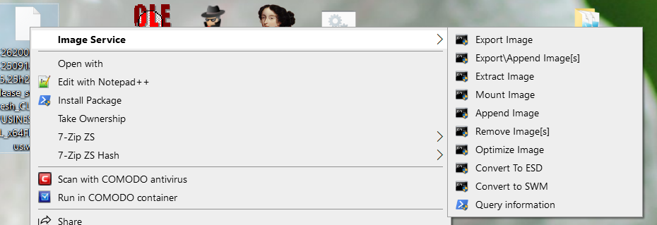
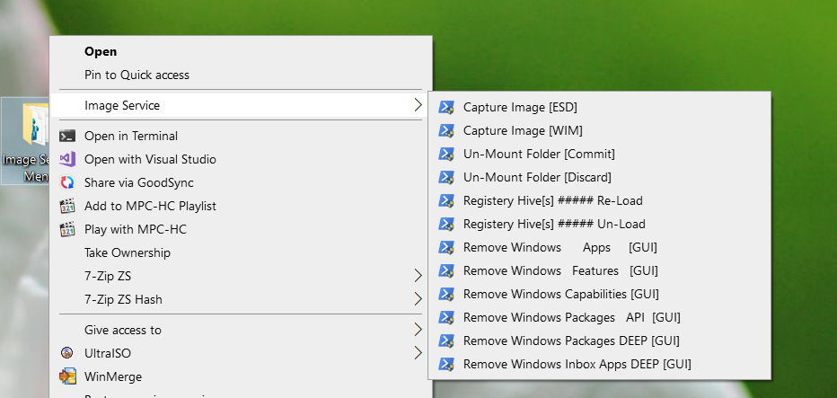

- **Image Service Menu**  
  A Windows Explorer context menu extension (via `.reg` file) that integrates **wimlib-imagex** for servicing Windows images (`WIM`, `ESD`, `SWM`) and mounted folders.  
  > ⚠️ Requires `wimlib-imagex.exe` to be copied into `C:\Windows\System32`.

## Screenshots

  
  

  **Supported Actions (on WIM/ESD/SWM files):**
  - `Export Image` — Export selected image(s) to a new file.
  - `Export/Append Image[s]` — Append or export multiple images.
  - `Extract Image` — Extract contents of an image to a folder.
  - `Mount Image` — Mount a WIM/ESD/SWM image for modification.
  - `Append Image` — Append an image to an existing container.
  - `Remove Image[s]` — Delete one or more images from the file.
  - `Optimize Image` — Rebuild and reduce size of a WIM/ESD/SWM.
  - `Convert to ESD` — Convert WIM to compressed ESD format.
  - `Convert to SWM` — Split WIM into multiple SWM parts.
  - `Query Information` — Display metadata and details about the image.

  **Supported Actions (on folders / mounted images):**
  - `Capture Image [ESD]` — Capture a folder as an ESD image.
  - `Capture Image [WIM]` — Capture a folder as a WIM image.
  - `Un-Mount Folder [Commit]` — Commit and save changes to a mounted folder.
  - `Un-Mount Folder [Discard]` — Unmount and discard all changes.
  - `Registry Hive(s) Re-Load` — Load Windows registry hives from a mounted image.
  - `Registry Hive(s) Un-Load` — Unload previously mounted registry hives.
  - `Remove Windows Apps [GUI]` — Remove UWP apps from a mounted image.
  - `Remove Windows Features [GUI]` — Remove Windows optional features.
  - `Remove Windows Capabilities [GUI]` — Remove additional Windows capabilities.
  - `Remove Windows Packages API [GUI]` — Remove Windows packages via API.
  - `Remove Windows Packages DEEP [GUI]` — Force deep removal of packages.
  - `Remove Windows Inbox Apps DEEP [GUI]` — Remove built-in inbox applications deeply.

---

This gives users a **powerful right-click menu** to fully service and customize Windows images without manually running DISM or wimlib commands.
